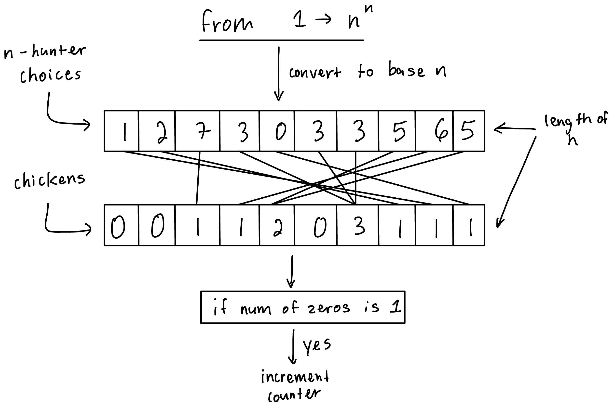
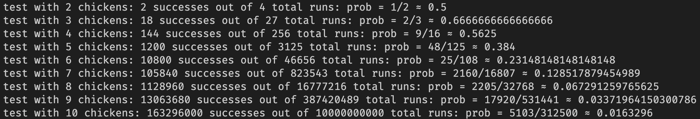

# Chickens

## Description
This program gives the answer to the following problem:
>There are $n$ 100% accuracy hunters and $n$ chickens. The hunters line up side-to-side in front of the chickens, which are also lined up. Each hunter picks a chicken to shoot without communication with the other hunters. Each hunter shoots their chosen chicken at the same time. What is the probability that exactly 1 chicken survives?

The program solves this problem by bruteforcing all possible outcomes. Instead of using `for` loops to go through all possiblities, it uses numbers in different bases to represent the scenarios, exploiting the fact that computers can increment numbers quickly. It then parallelizes this with the excellent `rayon` library in the Rust Programming Language.

## How to Run
By default, the program will calculate the probability for 2 chickens up to 10 chickens. To run the program, simply run `cargo run` or run `cargo run --release` for faster speeds. The program will print out the relevant probabilities and counts in a neat fashion.

## Example
`cargo run --release`
